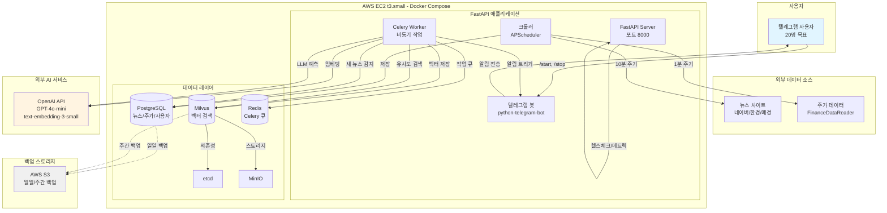
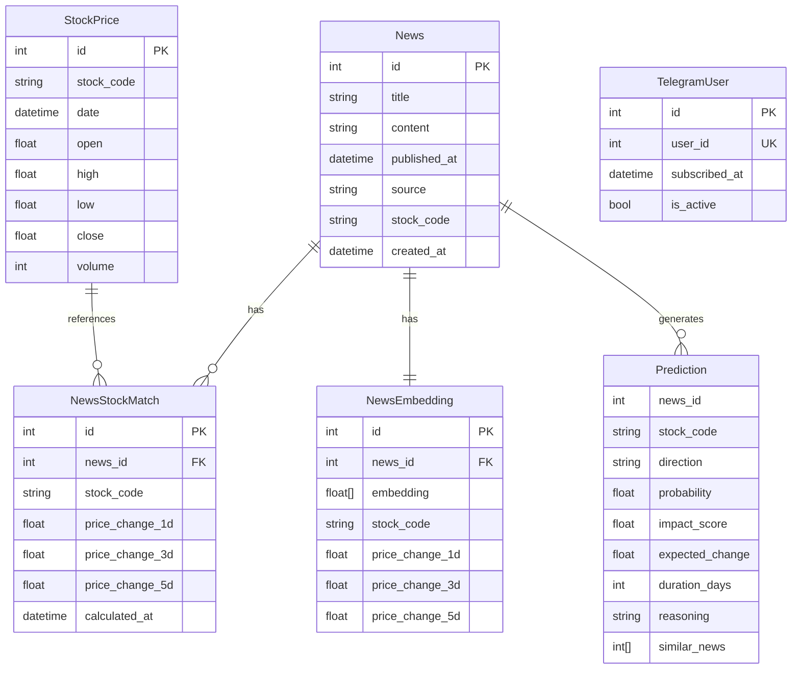
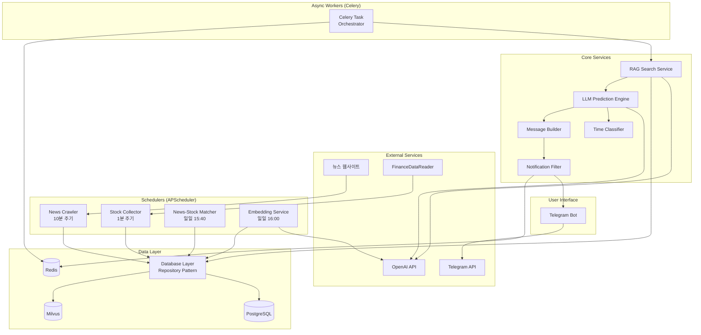

# Craveny Fullstack Architecture Document

**버전:** 1.0
**날짜:** 2025-10-31
**상태:** 초안

---

## 목차

1. [소개](#1-소개)
2. [고수준 아키텍처](#2-고수준-아키텍처)
3. [기술 스택](#3-기술-스택)
4. [데이터 모델](#4-데이터-모델)
5. [API 명세](#5-api-명세)
6. [컴포넌트](#6-컴포넌트)
7. [데이터베이스 스키마](#7-데이터베이스-스키마)
8. [통합 프로젝트 구조](#8-통합-프로젝트-구조)
9. [코딩 표준](#9-코딩-표준)
10. [개발 워크플로우](#10-개발-워크플로우)
11. [배포 아키텍처](#11-배포-아키텍처)
12. [보안 및 성능](#12-보안-및-성능)
13. [테스팅 전략](#13-테스팅-전략)
14. [에러 핸들링 전략](#14-에러-핸들링-전략)
15. [모니터링 및 관찰성](#15-모니터링-및-관찰성)

---

## 1. 소개

### 1.1 개요

이 문서는 **Craveny**의 전체 풀스택 아키텍처를 정의합니다. 백엔드 시스템, 프론트엔드 구현(텔레그램 봇 인터페이스), 그리고 이들의 통합 방식을 포함합니다. AI 기반 개발의 단일 진실 공급원(Single Source of Truth)으로 기능하며, 전체 기술 스택의 일관성을 보장합니다.

이 통합 접근 방식은 백엔드 데이터 처리, LLM 기반 예측, 텔레그램 알림 전송이 긴밀하게 통합된 현대적 풀스택 애플리케이션의 개발 프로세스를 간소화합니다.

### 1.2 스타터 템플릿 또는 기존 프로젝트

**상태:** N/A - 완전 신규 프로젝트 (Greenfield)

**분석:**
- PRD에 기존 스타터 템플릿이나 코드베이스 언급 없음
- 맞춤형 요구사항으로 처음부터 구축
- 기술 스택 선택은 PRD Technical Assumptions에 명시되어 있음
- 프레임워크별 스타터 불필요 (FastAPI + 텔레그램 봇은 직관적)

**결정:** 다음 방식으로 신규 개발 진행:
- 표준 FastAPI 프로젝트 구조
- Docker Compose로 인프라 오케스트레이션
- Python 모범 사례 (Black, Flake8, pytest)

### 1.3 변경 이력

| 날짜 | 버전 | 설명 | 작성자 |
|------|------|------|--------|
| 2025-10-31 | 1.0 | PRD v1.1 기반 초기 아키텍처 문서 생성 | Winston (Architect) |

---

## 2. 고수준 아키텍처

### 2.1 기술 요약

Craveny는 **Monolith 아키텍처** 기반의 단일 FastAPI 애플리케이션으로 구성됩니다. 뉴스/주가 데이터 수집, LLM 기반 예측, 텔레그램 알림 전송을 하나의 통합된 백엔드 서비스에서 처리합니다.

**핵심 구성:**
- **백엔드:** Python 3.11+ FastAPI로 RESTful API 및 비동기 작업 처리
- **프론트엔드:** 텔레그램 봇 (별도 웹/앱 UI 없음)
- **데이터 파이프라인:** APScheduler로 주기적 크롤링, Celery로 비동기 LLM 분석
- **AI/ML:** OpenAI GPT-4o-mini (예측), text-embedding-3-small (768차원 벡터)
- **데이터 저장:** PostgreSQL (관계형 데이터), Milvus (벡터 검색), Redis (Celery 큐)
- **배포:** Docker Compose로 모든 서비스 오케스트레이션, AWS EC2 단일 인스턴스 배포

이 아키텍처는 2주 MVP 목표, 100명 사용자 규모, $100 이하 비용 제약을 충족하며, Phase 2에서 마이크로서비스로 전환 가능한 확장성을 제공합니다.

### 2.2 플랫폼 및 인프라 선택

**최종 선택:**

**플랫폼:** AWS EC2 (t3.small, 2 vCPU, 2GB RAM)
**핵심 서비스:**
- **컴퓨팅:** EC2 단일 인스턴스 (모든 서비스 Docker Compose로 실행)
- **데이터베이스:** PostgreSQL 13+ (Docker 컨테이너)
- **벡터 DB:** Milvus 2.x (etcd, MinIO 포함 Docker 구성)
- **캐시/큐:** Redis 7+ (Docker 컨테이너)
- **백업:** AWS S3 (PostgreSQL/Milvus 일일/주간 백업)

**배포 호스트 및 리전:**
- **리전:** ap-northeast-2 (서울) - 한국 증시 데이터 수집 및 사용자 위치 최적화
- **가용 영역:** Single AZ (MVP, 고가용성 불필요)

**선택 근거:**
- ✅ **비용 통제:** EC2 t3.small ~$15/월, S3 백업 ~$5/월 → 총 $50/월 이내
- ✅ **Milvus 완전 제어:** Docker로 로컬 운영, 벡터 수 무제한
- ✅ **단순성:** 단일 인스턴스 관리, docker-compose up 배포
- ✅ **확장성:** Phase 2에서 AWS RDS, ElastiCache, ECS 전환 가능

### 2.3 레포지토리 구조

**구조:** Monorepo
**Monorepo 도구:** 없음 (단순 Python 프로젝트, 복잡도 낮음)
**패키지 구성 전략:**

```
단일 레포지토리 내 논리적 모듈 분리:
- backend/ (FastAPI 앱, 크롤러, LLM, 텔레그램 봇)
- data/ (수집된 원본 데이터, 로그)
- scripts/ (초기 데이터 수집, DB 마이그레이션)
- tests/ (Unit, Integration 테스트)
- docs/ (PRD, 아키텍처 문서)
```

**근거:**
- MVP 규모에서 Nx/Turborepo 같은 Monorepo 도구는 과도한 복잡도
- Python 프로젝트는 모듈 시스템으로 충분히 구조화 가능
- 단일 팀 개발, 코드 공유 용이, CI/CD 단순화

### 2.4 고수준 아키텍처 다이어그램



### 2.5 아키텍처 패턴

**적용된 패턴 및 근거:**

- **Monolith Architecture:** 단일 FastAPI 애플리케이션 - _근거: 2주 MVP, <100 사용자 규모에 최적, 빠른 개발 및 배포_

- **Background Job Processing (Celery):** 비동기 작업 큐 패턴 - _근거: 뉴스 크롤링, LLM 분석, 알림 전송을 메인 요청 흐름과 분리하여 성능 최적화_

- **RAG (Retrieval-Augmented Generation):** 벡터 검색 + LLM 생성 - _근거: 과거 유사 뉴스 패턴을 활용하여 예측 정확도 향상, LLM 환각(hallucination) 감소_

- **Repository Pattern:** 데이터 접근 추상화 - _근거: PostgreSQL/Milvus 접근 로직 캡슐화, 테스트 용이성, 향후 DB 마이그레이션 유연성_

- **Scheduled Task Pattern (APScheduler):** 주기적 작업 실행 - _근거: 뉴스 크롤링(10분), 주가 수집(1분), 매칭 계산(일일)을 안정적으로 자동화_

- **Event-Driven Notification:** 이벤트 기반 알림 트리거 - _근거: 새 뉴스 발생 → 예측 → 필터링 → 알림 파이프라인을 느슨하게 결합_

- **Microservices-Ready Modular Design:** 모듈화된 코드 구조 - _근거: Phase 2 마이크로서비스 전환 대비, 크롤러/LLM/봇을 독립 모듈로 설계_

---

## 3. 기술 스택

### 3.1 기술 스택 테이블

이 테이블은 프로젝트의 **단일 진실 공급원(Single Source of Truth)**입니다. 모든 개발은 아래 명시된 정확한 버전을 사용해야 합니다.

| 카테고리 | 기술 | 버전 | 목적 | 선택 근거 |
|---------|------|------|------|-----------|
| **백엔드 언어** | Python | 3.11+ | 백엔드 개발, 데이터 처리, ML 통합 | 데이터/ML/API에 최적, 풍부한 라이브러리 생태계, 팀 숙련도 |
| **백엔드 프레임워크** | FastAPI | 0.104+ | RESTful API, 비동기 처리, 헬스체크 엔드포인트 | 비동기 우수, 자동 문서화, 타입 힌트 지원, 빠른 개발 속도 |
| **API 스타일** | REST | - | 헬스체크/메트릭 조회 API | 단순 CRUD 충분, 텔레그램 봇이 주 인터페이스 |
| **스케줄러** | APScheduler | 3.10+ | 주기적 크롤링 (뉴스 10분, 주가 1분) | 간단한 스케줄링에 충분, FastAPI 통합 용이 |
| **비동기 작업 큐** | Celery | 5.3+ | LLM 예측, 임베딩, 알림 전송 비동기 처리 | 표준 Python 비동기 작업, 재시도/모니터링 기능 |
| **메시지 브로커/캐시** | Redis | 7.0+ | Celery 메시지 브로커, 중복 방지 캐시 | 빠른 인메모리 저장소, Celery 표준 백엔드 |
| **관계형 데이터베이스** | PostgreSQL | 13+ | 뉴스, 주가, 매칭 결과, 사용자 데이터 | 안정적, ACID 보장, 한국어 지원, JSON 컬럼 지원 |
| **벡터 데이터베이스** | Milvus | 2.3+ | 뉴스 임베딩 저장 및 유사도 검색 | 무료, 무제한, 데이터 주권, L2/IP 거리 지원 |
| **벡터 DB 의존성** | etcd | 3.5+ | Milvus 메타데이터 저장 | Milvus 필수 의존성 |
| **벡터 DB 스토리지** | MinIO | Latest | Milvus 데이터 영구 저장 | Milvus 필수 의존성, S3 호환 |
| **LLM** | OpenAI GPT-4o-mini | Latest API | 뉴스 영향도 예측, 전략 메시지 생성 | 비용 대비 성능 우수 ($0.01~0.02/건), 안정적 API, 한국어 지원 |
| **임베딩 모델** | OpenAI text-embedding-3-small | Latest API | 뉴스 텍스트 → 768차원 벡터 변환 | 비용 효율적 ($0.0001/건), 한국어 성능 우수, Milvus 호환 |
| **크롤링 라이브러리** | BeautifulSoup4 | 4.12+ | HTML 파싱, 뉴스 크롤링 | 간단하고 충분, 학습 곡선 낮음 |
| **주가 데이터** | FinanceDataReader | 0.9+ | 한국 증시 주가 수집 | 한국 시장 특화, 무료, KRX 데이터 지원 |
| **텔레그램 봇** | python-telegram-bot | 20.7+ | 텔레그램 봇 구현 및 알림 전송 | 텔레그램 봇 API 표준, 비동기 지원, 풍부한 문서 |
| **컨테이너화** | Docker | 24+ | 모든 서비스 컨테이너화 | 환경 일관성, 로컬/프로덕션 동일 실행 |
| **오케스트레이션** | Docker Compose | 2.20+ | 멀티 컨테이너 관리 (6개 서비스) | 단순 배포, docker-compose up으로 즉시 실행 |
| **백엔드 테스팅** | pytest | 7.4+ | Unit, Integration 테스트 | Python 표준, 픽스처 지원, 플러그인 풍부 |
| **비동기 테스팅** | pytest-asyncio | 0.21+ | FastAPI 비동기 함수 테스트 | pytest와 통합, 비동기 테스트 필수 |
| **코드 포맷터** | Black | 23.0+ | 일관된 코드 스타일 | Python 표준, 설정 불필요, CI 통합 용이 |
| **린터** | Flake8 | 6.0+ | 코드 품질 검사 | PEP8 준수, 정적 분석, Black과 호환 |
| **타입 체커** | mypy | 1.5+ | 타입 힌트 검증 | FastAPI 타입 안정성, 런타임 오류 사전 발견 |
| **버전 관리** | Git | 2.40+ | 소스 코드 관리 | 표준 버전 관리 시스템 |
| **원격 레포지토리** | GitHub | - | 코드 호스팅, 협업, CI/CD | 무료, Actions 통합, 풍부한 생태계 |
| **CI/CD** | GitHub Actions | - | 자동 테스트, 수동 배포 | 무료, GitHub 통합, 간단한 YAML 설정 |
| **클라우드 플랫폼** | AWS EC2 | t3.small | 서버 호스팅 | 비용 예측 가능 (~$15/월), 완전한 제어 |
| **백업 스토리지** | AWS S3 | - | PostgreSQL/Milvus 백업 보관 | 저렴한 스토리지 (~$5/월), 7일/4주 보관 |
| **모니터링** | Python logging | Built-in | 파일 로그 기록 | MVP는 간단한 로깅으로 충분, Phase 2 CloudWatch |
| **환경 변수 관리** | python-dotenv | 1.0+ | .env 파일 로드 | 민감 정보 분리, Git 커밋 방지 |

---

## 4. 데이터 모델

이 섹션은 프론트엔드(텔레그램 봇)와 백엔드 간 공유되는 핵심 비즈니스 엔티티를 정의합니다. Python 프로젝트이므로 **Pydantic 모델**을 사용하여 타입 안전성과 FastAPI 통합을 제공합니다.

### 4.1 News (뉴스)

**목적:** 크롤링한 증권 뉴스 원본 데이터 저장

**주요 속성:**
- `id`: int - 고유 식별자 (Primary Key)
- `title`: str - 뉴스 제목 (최대 500자)
- `content`: str - 뉴스 본문 전체 텍스트
- `published_at`: datetime - 뉴스 발표 시간 (KST)
- `source`: str - 언론사 (예: "네이버", "한국경제", "매일경제")
- `stock_code`: str - 관련 종목코드 (예: "005930" = 삼성전자)
- `created_at`: datetime - DB 저장 시간

**Pydantic 모델:**

```python
from datetime import datetime
from pydantic import BaseModel, Field

class News(BaseModel):
    id: int
    title: str = Field(..., max_length=500)
    content: str
    published_at: datetime
    source: str = Field(..., max_length=100)
    stock_code: str = Field(..., max_length=10)
    created_at: datetime = Field(default_factory=datetime.now)

    class Config:
        from_attributes = True  # SQLAlchemy ORM 호환
```

**관계:**
- `NewsStockMatch` (1:N): 하나의 뉴스는 여러 시점의 주가 변동률 매칭을 가질 수 있음
- `NewsEmbedding` (1:1): 각 뉴스는 하나의 벡터 임베딩을 가짐

### 4.2 StockPrice (주가)

**목적:** 1분 단위 주가 데이터 저장 (OHLCV)

**주요 속성:**
- `id`: int - 고유 식별자 (Primary Key)
- `stock_code`: str - 종목코드 (예: "005930")
- `date`: datetime - 주가 시점 (1분봉)
- `open`: float - 시가
- `high`: float - 고가
- `low`: float - 저가
- `close`: float - 종가
- `volume`: int - 거래량

**Pydantic 모델:**

```python
from datetime import datetime
from pydantic import BaseModel, Field

class StockPrice(BaseModel):
    id: int
    stock_code: str = Field(..., max_length=10)
    date: datetime
    open: float = Field(..., gt=0)
    high: float = Field(..., gt=0)
    low: float = Field(..., gt=0)
    close: float = Field(..., gt=0)
    volume: int = Field(..., ge=0)

    class Config:
        from_attributes = True
```

### 4.3 NewsStockMatch (뉴스-주가 매칭)

**목적:** 뉴스 발표 후 1일/3일/5일 주가 변동률 저장 (RAG 학습 데이터)

**주요 속성:**
- `id`: int - 고유 식별자 (Primary Key)
- `news_id`: int - 뉴스 ID (Foreign Key → News.id)
- `stock_code`: str - 종목코드
- `price_change_1d`: float - 1일 후 변동률 (%)
- `price_change_3d`: float - 3일 후 변동률 (%)
- `price_change_5d`: float - 5일 후 변동률 (%)
- `calculated_at`: datetime - 계산 완료 시간

**Pydantic 모델:**

```python
from datetime import datetime
from pydantic import BaseModel, Field

class NewsStockMatch(BaseModel):
    id: int
    news_id: int
    stock_code: str = Field(..., max_length=10)
    price_change_1d: float | None = None  # 1일 미경과 시 None
    price_change_3d: float | None = None
    price_change_5d: float | None = None
    calculated_at: datetime

    class Config:
        from_attributes = True
```

### 4.4 TelegramUser (텔레그램 사용자)

**목적:** 텔레그램 봇 구독자 관리

**주요 속성:**
- `id`: int - 고유 식별자 (Primary Key)
- `user_id`: int - 텔레그램 사용자 ID (Unique)
- `subscribed_at`: datetime - 구독 시작 시간
- `is_active`: bool - 활성 상태 (/stop 시 False)

**Pydantic 모델:**

```python
from datetime import datetime
from pydantic import BaseModel, Field

class TelegramUser(BaseModel):
    id: int
    user_id: int = Field(..., description="Telegram user ID")
    subscribed_at: datetime = Field(default_factory=datetime.now)
    is_active: bool = Field(default=True)

    class Config:
        from_attributes = True
```

### 4.5 NewsEmbedding (뉴스 임베딩 - Milvus)

**목적:** Milvus 벡터 DB에 저장되는 뉴스 임베딩 (RAG 검색용)

**주요 속성:**
- `id`: int - Milvus 자동 생성 ID (Auto ID)
- `news_id`: int - PostgreSQL News.id 참조
- `embedding`: List[float] - 768차원 벡터 (OpenAI text-embedding-3-small)
- `stock_code`: str - 종목코드 (필터링용)
- `price_change_1d`: float - 1일 후 변동률 (메타데이터)
- `price_change_3d`: float - 3일 후 변동률
- `price_change_5d`: float - 5일 후 변동률

**Pydantic 모델:**

```python
from pydantic import BaseModel, Field

class NewsEmbedding(BaseModel):
    id: int | None = None  # Milvus 자동 생성
    news_id: int
    embedding: list[float] = Field(..., min_length=768, max_length=768)
    stock_code: str = Field(..., max_length=10)
    price_change_1d: float | None = None
    price_change_3d: float | None = None
    price_change_5d: float | None = None
```

### 4.6 Prediction (예측 결과 - 비즈니스 로직)

**목적:** LLM 예측 결과를 담는 DTO (Data Transfer Object, DB 저장 안 함)

**주요 속성:**
- `news_id`: int - 예측 대상 뉴스 ID
- `stock_code`: str - 종목코드
- `direction`: str - 방향 ("UP" | "DOWN" | "NEUTRAL")
- `probability`: float - 상승/하락 확률 (0~100)
- `impact_score`: float - 영향도 점수 (0~10)
- `expected_change`: float - 예상 변동폭 (%)
- `duration_days`: int - 영향 지속 기간 (일)
- `reasoning`: str - 예측 근거 (LLM 생성 텍스트)
- `similar_news`: List[int] - 유사 뉴스 ID 목록 (TOP 5)

**Pydantic 모델:**

```python
from pydantic import BaseModel, Field
from typing import Literal

class Prediction(BaseModel):
    news_id: int
    stock_code: str = Field(..., max_length=10)
    direction: Literal["UP", "DOWN", "NEUTRAL"]
    probability: float = Field(..., ge=0, le=100)
    impact_score: float = Field(..., ge=0, le=10)
    expected_change: float  # 예: +7.2 또는 -3.5
    duration_days: int = Field(..., ge=1, le=30)
    reasoning: str = Field(..., max_length=2000)
    similar_news: list[int] = Field(default_factory=list, max_length=5)
```

### 4.7 데이터 모델 관계도



---

## 5. API 명세

Craveny는 **텔레그램 봇이 주 인터페이스**이므로, REST API는 헬스체크, 모니터링, 내부 관리 목적으로만 제공됩니다.

### 5.1 REST API Specification (OpenAPI 3.0)

**주요 엔드포인트:**

#### GET /health

시스템 전체 상태를 확인합니다.

**응답 200 (정상):**
```json
{
  "status": "healthy",
  "postgres": true,
  "milvus": true,
  "redis": true,
  "news_count": 1247,
  "vector_count": 1247,
  "last_news_collected": "2025-10-31T14:35:22+09:00"
}
```

**응답 503 (비정상):**
```json
{
  "status": "unhealthy",
  "postgres": false,
  "milvus": true,
  "redis": true,
  "error": "PostgreSQL connection failed"
}
```

#### GET /metrics

시스템 메트릭을 조회합니다.

**응답 200:**
```json
{
  "last_prediction": "2025-10-31T14:30:15+09:00",
  "telegram_notifications_sent_24h": 37,
  "average_prediction_time": 3.24,
  "total_active_users": 18,
  "celery_queue_size": 2,
  "openai_api_cost_today": 1.47
}
```

**자동 문서화:**
- Swagger UI: `http://localhost:8000/docs`
- ReDoc: `http://localhost:8000/redoc`

---

## 6. 컴포넌트

시스템을 논리적 컴포넌트로 분해하여 각 컴포넌트의 책임과 인터페이스를 명확히 정의합니다.

### 6.1 News Crawler (뉴스 크롤러)

**책임:** 네이버 뉴스, 한국경제, 매일경제에서 증권 뉴스 자동 크롤링

**주요 인터페이스:**
- `crawl_news(source: str) -> List[News]`
- `extract_stock_code(title: str, content: str) -> str | None`
- `is_duplicate(news: News) -> bool`
- `save_news(news: News) -> int`

**기술 상세:** `backend/crawlers/news_crawler.py`, APScheduler 10분 주기

### 6.2 Stock Price Collector (주가 수집기)

**책임:** FinanceDataReader로 한국 증시 주가 데이터 수집 (1분 주기)

**주요 인터페이스:**
- `collect_stock_prices(stock_codes: List[str]) -> List[StockPrice]`
- `is_market_open() -> bool`
- `save_prices(prices: List[StockPrice]) -> int`

**기술 상세:** `backend/crawlers/stock_crawler.py`, 장중 9:00~15:30만 실행

### 6.3 Embedding Service (임베딩 서비스)

**책임:** 뉴스 텍스트 → 768차원 벡터 변환 (OpenAI API)

**주요 인터페이스:**
- `embed_news(news: News) -> List[float]`
- `batch_embed(news_list: List[News]) -> List[NewsEmbedding]`
- `save_to_milvus(embeddings: List[NewsEmbedding]) -> int`

**기술 상세:** `backend/llm/embedder.py`, 매일 16:00 일괄 처리

### 6.4 RAG Search Service (벡터 유사도 검색)

**책임:** 새 뉴스의 유사 과거 뉴스 TOP 5 검색 (<100ms)

**주요 인터페이스:**
- `search_similar_news(news_text: str, top_k: int = 5) -> List[News]`
- `embed_query(text: str) -> List[float]`
- `fetch_news_details(news_ids: List[int]) -> List[News]`

**기술 상세:** `backend/llm/similarity_search.py`, Milvus L2 거리

### 6.5 LLM Prediction Engine (예측 엔진)

**책임:** 현재 뉴스 + 유사 과거 뉴스 + 현재 주가 → LLM 종합 분석 (2~5초)

**주요 인터페이스:**
- `predict(news: News, similar_news: List[News], current_price: float) -> Prediction`
- `build_prompt(news: News, similar_news: List[News]) -> str`
- `parse_llm_response(response: str) -> Prediction`

**기술 상세:** `backend/llm/predictor.py`, GPT-4o-mini API

### 6.6 Telegram Bot (텔레그램 봇)

**책임:** 사용자 명령어 처리 및 알림 메시지 전송

**주요 인터페이스:**
- `send_notification(user_id: int, message: str) -> bool`
- `handle_start(user_id: int) -> None`
- `handle_stop(user_id: int) -> None`

**기술 상세:** `backend/telegram/bot.py`, python-telegram-bot

### 6.7 Celery Task Orchestrator (비동기 작업 오케스트레이터)

**책임:** 새 뉴스 감지 → 예측 파이프라인 트리거 (순차 실행)

**주요 인터페이스:**
- `@celery.task process_new_news(news_id: int) -> None`
- `@celery.task retry_failed_task(task_id: str) -> None`

**기술 상세:** `backend/scheduler/celery_tasks.py`, Redis 브로커

### 6.8 컴포넌트 다이어그램



---

## 7. 데이터베이스 스키마

### 7.1 PostgreSQL 스키마

#### News (뉴스) 테이블

```sql
CREATE TABLE news (
    id SERIAL PRIMARY KEY,
    title VARCHAR(500) NOT NULL,
    content TEXT NOT NULL,
    published_at TIMESTAMP WITH TIME ZONE NOT NULL,
    source VARCHAR(100) NOT NULL,
    stock_code VARCHAR(10) NOT NULL,
    created_at TIMESTAMP WITH TIME ZONE DEFAULT NOW()
);

CREATE INDEX idx_news_stock_code ON news(stock_code);
CREATE INDEX idx_news_published_at ON news(published_at DESC);
CREATE INDEX idx_news_stock_published ON news(stock_code, published_at DESC);
```

#### StockPrice (주가) 테이블

```sql
CREATE TABLE stock_prices (
    id SERIAL PRIMARY KEY,
    stock_code VARCHAR(10) NOT NULL,
    date TIMESTAMP WITH TIME ZONE NOT NULL,
    open DECIMAL(10, 2) NOT NULL CHECK (open > 0),
    high DECIMAL(10, 2) NOT NULL CHECK (high > 0),
    low DECIMAL(10, 2) NOT NULL CHECK (low > 0),
    close DECIMAL(10, 2) NOT NULL CHECK (close > 0),
    volume BIGINT NOT NULL CHECK (volume >= 0),

    CONSTRAINT stock_prices_unique_key UNIQUE (stock_code, date)
);

CREATE INDEX idx_stock_prices_stock_date ON stock_prices(stock_code, date DESC);
```

#### NewsStockMatch (뉴스-주가 매칭) 테이블

```sql
CREATE TABLE news_stock_match (
    id SERIAL PRIMARY KEY,
    news_id INTEGER NOT NULL REFERENCES news(id) ON DELETE CASCADE,
    stock_code VARCHAR(10) NOT NULL,
    price_change_1d DECIMAL(6, 2),
    price_change_3d DECIMAL(6, 2),
    price_change_5d DECIMAL(6, 2),
    calculated_at TIMESTAMP WITH TIME ZONE DEFAULT NOW(),

    CONSTRAINT news_stock_match_unique_key UNIQUE (news_id)
);

CREATE INDEX idx_news_stock_match_news_id ON news_stock_match(news_id);
```

#### TelegramUser (텔레그램 사용자) 테이블

```sql
CREATE TABLE telegram_users (
    id SERIAL PRIMARY KEY,
    user_id BIGINT NOT NULL UNIQUE,
    subscribed_at TIMESTAMP WITH TIME ZONE DEFAULT NOW(),
    is_active BOOLEAN DEFAULT TRUE,
    last_activity_at TIMESTAMP WITH TIME ZONE DEFAULT NOW()
);

CREATE INDEX idx_telegram_users_is_active ON telegram_users(is_active)
    WHERE is_active = TRUE;
```

### 7.2 Milvus 벡터 DB 스키마

#### NewsEmbedding 컬렉션

```python
# Milvus 컬렉션 생성 (scripts/init_milvus.py)
from pymilvus import connections, FieldSchema, CollectionSchema, DataType, Collection

fields = [
    FieldSchema(name="id", dtype=DataType.INT64, is_primary=True, auto_id=True),
    FieldSchema(name="news_id", dtype=DataType.INT64),
    FieldSchema(name="embedding", dtype=DataType.FLOAT_VECTOR, dim=768),
    FieldSchema(name="stock_code", dtype=DataType.VARCHAR, max_length=10),
    FieldSchema(name="price_change_1d", dtype=DataType.FLOAT),
    FieldSchema(name="price_change_3d", dtype=DataType.FLOAT),
    FieldSchema(name="price_change_5d", dtype=DataType.FLOAT),
]

schema = CollectionSchema(fields=fields, description="뉴스 임베딩 (RAG)")
collection = Collection(name="news_embeddings", schema=schema)

# 인덱스 생성 (IVF_FLAT - 정확도 우선)
index_params = {
    "metric_type": "L2",
    "index_type": "IVF_FLAT",
    "params": {"nlist": 128}
}
collection.create_index(field_name="embedding", index_params=index_params)
```

---

## 8. 통합 프로젝트 구조

```plaintext
craveny/
├── .github/workflows/          # CI/CD
│   ├── ci.yml
│   └── deploy.yml
├── backend/                    # FastAPI 애플리케이션
│   ├── main.py                 # 진입점
│   ├── config.py               # 환경 변수
│   ├── crawlers/               # 데이터 수집
│   │   ├── news_crawler.py
│   │   ├── stock_crawler.py
│   │   └── news_stock_matcher.py
│   ├── llm/                    # AI/ML
│   │   ├── embedder.py
│   │   ├── similarity_search.py
│   │   ├── predictor.py
│   │   ├── time_classifier.py
│   │   └── prompts/
│   ├── telegram/               # 텔레그램 봇
│   │   ├── bot.py
│   │   ├── message_builder.py
│   │   ├── notification_filter.py
│   │   └── templates/
│   ├── db/                     # 데이터베이스
│   │   ├── models.py
│   │   ├── database.py
│   │   ├── milvus_client.py
│   │   └── repositories/
│   ├── scheduler/              # 스케줄링
│   │   ├── apscheduler_jobs.py
│   │   ├── celery_app.py
│   │   └── celery_tasks.py
│   ├── api/                    # REST API
│   │   ├── health.py
│   │   └── metrics.py
│   └── utils/
├── data/                       # 데이터 및 로그
├── scripts/                    # 유틸리티
│   ├── init_db.py
│   ├── init_milvus.py
│   └── initial_data_collection.py
├── tests/                      # 테스트
│   ├── unit/
│   ├── integration/
│   └── e2e/
├── docs/                       # 문서
│   ├── prd.md
│   └── architecture.md
├── infrastructure/             # 인프라
│   ├── docker-compose.yml
│   └── Dockerfile
├── .env.example
├── requirements.txt
├── requirements-dev.txt
└── README.md
```

---

## 9. 코딩 표준

### 9.1 필수 규칙

- **환경 변수 접근:** `backend/config.py`의 `settings` 객체만 사용
- **데이터베이스 접근:** Repository Pattern 필수
- **OpenAI API 호출:** `settings.OPENAI_MODEL` 사용
- **에러 처리:** 모든 외부 API 호출 try-except 래핑
- **로깅:** `print()` 금지, `logger` 사용
- **타입 힌트:** 모든 함수 시그니처 필수
- **비동기 함수:** FastAPI는 `async def`, Celery는 동기 함수

### 9.2 명명 규칙

| 요소 | 규칙 | 예시 |
|------|------|------|
| Python 모듈 | snake_case | `news_crawler.py` |
| Python 클래스 | PascalCase | `NewsRepository` |
| 함수/메서드 | snake_case | `get_news_by_id()` |
| 변수 | snake_case | `news_count` |
| 상수 | UPPER_SNAKE_CASE | `MAX_RETRY_COUNT` |
| 데이터베이스 테이블 | snake_case | `news`, `stock_prices` |
| API 엔드포인트 | kebab-case | `/health`, `/api/news` |

### 9.3 코드 포맷팅

```bash
# Black 포맷팅 (라인 길이 100)
black --line-length 100 backend/ tests/

# Flake8 린팅
flake8 backend/ tests/ --max-line-length 100

# mypy 타입 체크
mypy backend/ --ignore-missing-imports
```

---

## 10. 개발 워크플로우

### 10.1 로컬 개발 환경 설정

```bash
# 1. 레포지토리 클론
git clone https://github.com/your-org/craveny.git
cd craveny

# 2. Python 가상환경
python3.11 -m venv venv
source venv/bin/activate

# 3. 의존성 설치
pip install -r requirements.txt
pip install -r requirements-dev.txt

# 4. 환경 변수
cp .env.example .env
# .env 편집

# 5. Docker 서비스 실행
cd infrastructure
docker-compose up -d

# 6. DB 초기화
python scripts/init_db.py
python scripts/init_milvus.py
```

### 10.2 개발 명령어

```bash
# FastAPI 서버 (핫 리로드)
uvicorn backend.main:app --reload

# Celery Worker
celery -A backend.scheduler.celery_app worker --loglevel=info

# 텔레그램 봇
python -m backend.telegram.bot

# 테스트
pytest tests/
pytest --cov=backend tests/

# 코드 품질
black backend/ tests/
flake8 backend/ tests/
mypy backend/
```

---

## 11. 배포 아키텍처

### 11.1 배포 전략

**백엔드 배포:**
- **플랫폼:** AWS EC2 t3.small (서울 리전)
- **방식:** Docker Compose
- **배포:**
  ```bash
  git pull origin main
  docker-compose down
  docker-compose up -d --build
  ```

### 11.2 CI/CD 파이프라인

```yaml
# .github/workflows/ci.yml
name: CI
on: [push, pull_request]

jobs:
  test:
    runs-on: ubuntu-latest
    steps:
      - uses: actions/checkout@v3
      - name: Set up Python
        uses: actions/setup-python@v4
        with:
          python-version: '3.11'
      - name: Install dependencies
        run: |
          pip install -r requirements.txt
          pip install -r requirements-dev.txt
      - name: Run Tests
        run: pytest tests/ --cov=backend
```

### 11.3 환경

| 환경 | 용도 | 배포 방식 |
|------|------|-----------|
| Development | 로컬 개발 | Docker Compose |
| Production | 실제 서비스 | AWS EC2 |

---

## 12. 보안 및 성능

### 12.1 보안

- **입력 검증:** Pydantic 자동 검증
- **토큰 저장:** 환경 변수 (.env)
- **API 인증:** MVP는 없음 (AWS Security Group IP 제한)

### 12.2 성능

- **응답 시간 목표:** <5초 (뉴스 → 알림)
- **캐싱:** Redis (중복 알림 방지)
- **DB 최적화:** 인덱스 최적화

---

## 13. 테스팅 전략

### 13.1 테스트 피라미드

```
     E2E (5%)
    /        \
Integration (25%)
/              \
Unit (70%)
```

**목표:** Unit 커버리지 70% 이상

### 13.2 테스트 예시

```python
# tests/unit/test_time_classifier.py
def test_classify_time_premarket():
    dt = datetime(2025, 10, 31, 7, 30)
    assert classify_time(dt) == "PRE_MARKET"

# tests/integration/test_milvus_search.py
def test_search_similar_news_returns_top5():
    results = search_similar_news("삼성전자", top_k=5)
    assert len(results) == 5
```

---

## 14. 에러 핸들링 전략

### 14.1 에러 응답 포맷

```python
# backend/api/health.py
@router.get("/health")
async def health_check():
    try:
        pg_ok = check_postgres()
        if not pg_ok:
            raise HTTPException(status_code=503)
        return {"status": "healthy"}
    except Exception as e:
        logger.error(f"Health check failed: {e}")
        raise HTTPException(status_code=503)
```

---

## 15. 모니터링 및 관찰성

### 15.1 모니터링 스택

- **백엔드:** Python logging (파일)
- **에러 추적:** Python logging
- **메트릭:** `/metrics` 엔드포인트

### 15.2 주요 메트릭

- 요청 비율 (requests/min)
- 에러 비율 (%)
- 응답 시간 (평균/p95)
- Celery 큐 크기

---

**문서 작성 완료:** 2025-10-31
**다음 단계:** 개발 시작, Architect Checklist 실행 (선택적)
