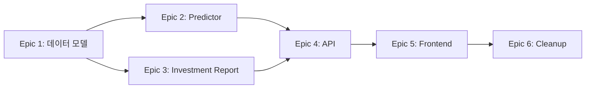

# 예측 시스템 구조 개선 프로젝트

## 📁 문서 구조

```
docs/prd/
├── README.md                                # 이 파일
├── prediction-system-refactoring.md        # 메인 PRD
└── epics/
    ├── epic-1-data-model.md                # Epic 1: 데이터 모델 변경
    ├── epic-2-predictor.md                 # Epic 2: Predictor 리팩토링
    ├── epic-3-investment-report.md         # Epic 3: Investment Report 개선
    ├── epic-4-api.md                       # Epic 4: API 업데이트
    ├── epic-5-frontend.md                  # Epic 5: 프론트엔드 업데이트
    └── epic-6-cleanup.md                   # Epic 6: 데이터 정리 및 문서화
```

## 🎯 프로젝트 개요

**목적**: 뉴스 분석과 가격 예측의 책임을 명확히 분리하여 시스템의 명확성과 유지보수성을 향상시킨다.

**핵심 변경사항**:
- **뉴스 분석 (Predictor)**: 가격 예측 → 영향도 분석
- **종합 리포트 (Investment Report)**: 뉴스 영향도 + 기술적 지표 → 가격 예측

## 📊 Epic 진행 상황

| Epic | 제목 | 상태 | 예상 기간 | 진행률 |
|------|------|------|-----------|--------|
| Epic 1 | 데이터 모델 변경 | 🔴 Ready | 1일 | 0% |
| Epic 2 | Predictor 리팩토링 | 🔴 Ready | 1일 | 0% |
| Epic 3 | Investment Report 개선 | 🔴 Ready | 1일 | 0% |
| Epic 4 | API 업데이트 | 🔴 Ready | 0.5일 | 0% |
| Epic 5 | 프론트엔드 업데이트 | 🔴 Ready | 1일 | 0% |
| Epic 6 | 데이터 정리 및 문서화 | 🔴 Ready | 0.5일 | 0% |

**총 예상 기간**: 5일

## 🚀 빠른 시작

### 1. PRD 읽기
먼저 [메인 PRD](./prediction-system-refactoring.md)를 읽고 전체 그림을 파악하세요.

### 2. Epic 1부터 순차적으로 진행
Epic은 순차적으로 진행해야 합니다:



### 3. Epic 별 Story 진행
각 Epic의 Story는 순차적으로 진행하세요:
- Story 1.1 → 1.2 → 1.3 → 1.4

## 📋 Epic 1: 데이터 모델 변경

**우선순위**: P0 (Critical)
**예상 기간**: 1일
**Story 개수**: 4개

### Story 목록
- **Story 1.1**: Prediction 모델 스키마 업데이트 (2시간)
- **Story 1.2**: 마이그레이션 스크립트 작성 (3시간)
- **Story 1.3**: 기존 데이터 마이그레이션 실행 (2시간)
- **Story 1.4**: 데이터 무결성 검증 (2시간)

### 시작하기
```bash
# Epic 1 문서 확인
cat docs/prd/epics/epic-1-data-model.md

# Story 1.1 시작
# 1. backend/db/models/prediction.py 수정
# 2. 새 필드 추가
# 3. 검증
```

📖 **상세 문서**: [epic-1-data-model.md](./epics/epic-1-data-model.md)

## 📋 Epic 2: Predictor 리팩토링

**우선순위**: P0 (Critical)
**예상 기간**: 1일
**선행 조건**: Epic 1 완료

### Story 목록
- **Story 2.1**: 프롬프트를 영향도 분석 중심으로 변경 (3시간)
- **Story 2.2**: 응답 파싱 로직 수정 (2시간)
- **Story 2.3**: 새 필드 저장 로직 구현 (2시간)
- **Story 2.4**: 단위 테스트 작성 및 검증 (3시간)

📖 **상세 문서**: [epic-2-predictor.md](./epics/epic-2-predictor.md)

## 📋 Epic 3: Investment Report 개선

**우선순위**: P0 (Critical)
**예상 기간**: 1일
**선행 조건**: Epic 1, Epic 2 완료

### Story 목록
- **Story 3.1**: 뉴스 영향도 집계 로직 구현
- **Story 3.2**: 가격 예측 프롬프트 추가
- **Story 3.3**: 리포트 생성 로직 수정
- **Story 3.4**: 통합 테스트

📖 **상세 문서**: [epic-3-investment-report.md](./epics/epic-3-investment-report.md)

## 📋 Epic 4: API 업데이트

**우선순위**: P1 (High)
**예상 기간**: 0.5일
**선행 조건**: Epic 2, Epic 3 완료

### Story 목록
- **Story 4.1**: Prediction API 응답 구조 변경
- **Story 4.2**: Investment Report API 응답 구조 변경
- **Story 4.3**: API 문서 업데이트
- **Story 4.4**: 하위 호환성 검증

📖 **상세 문서**: [epic-4-api.md](./epics/epic-4-api.md)

## 📋 Epic 5: 프론트엔드 업데이트

**우선순위**: P1 (High)
**예상 기간**: 1일
**선행 조건**: Epic 4 완료

### Story 목록
- **Story 5.1**: 뉴스 영향도 표시 컴포넌트 개발
- **Story 5.2**: 종합 리포트 UI 개선
- **Story 5.3**: 기존 신뢰도 표시 제거
- **Story 5.4**: E2E 테스트

📖 **상세 문서**: [epic-5-frontend.md](./epics/epic-5-frontend.md)

## 📋 Epic 6: 데이터 정리 및 문서화

**우선순위**: P2 (Medium)
**예상 기간**: 0.5일
**선행 조건**: Epic 1-5 완료

### Story 목록
- **Story 6.1**: Deprecated 필드 제거
- **Story 6.2**: 코드 주석 및 문서 업데이트
- **Story 6.3**: API 문서 최종 업데이트
- **Story 6.4**: 운영 가이드 작성

📖 **상세 문서**: [epic-6-cleanup.md](./epics/epic-6-cleanup.md)

## ⚠️ 중요 사항

### 데이터 마이그레이션 전 체크리스트
- [ ] 전체 DB 백업 완료
- [ ] 스테이징 환경에서 마이그레이션 테스트 성공
- [ ] 롤백 스크립트 준비
- [ ] 마이그레이션 실행 시간 확인 (예상: < 1분)
- [ ] 다운타임 공지 (필요시)

### Breaking Changes
이 프로젝트는 다음 Breaking Changes를 포함합니다:
1. API 응답 구조 변경 (새 필드 추가, 기존 필드 deprecated)
2. 프론트엔드 UI 변경 (신뢰도 → 영향도)

**대응 방안**:
- API 버전 관리 (v1 유지, v2 신규)
- 점진적 마이그레이션
- 충분한 테스트 기간

## 🔗 관련 리소스

### 코드 파일
- `backend/db/models/prediction.py` - Prediction 모델
- `backend/llm/predictor.py` - 뉴스 분석 로직
- `backend/llm/investment_report.py` - 종합 리포트 생성
- `backend/services/evaluation_service.py` - 평가 서비스
- `backend/api/predictions.py` - Prediction API
- `backend/api/stocks.py` - Investment Report API

### 스크립트
- `scripts/verify_prediction_data.py` - 데이터 검증 (생성 예정)
- `backend/alembic/versions/` - 마이그레이션 스크립트 (생성 예정)

### 문서
- [메인 PRD](./prediction-system-refactoring.md)
- [데이터 모델 스키마](../../backend/db/models/prediction.py)
- API 문서 (Swagger) - `http://localhost:8000/docs`

## 📞 문의

질문이나 문제가 있으면 이슈를 생성하거나 팀에 문의하세요.

---

**작성일**: 2025-01-06
**버전**: 1.0
**상태**: Planning
